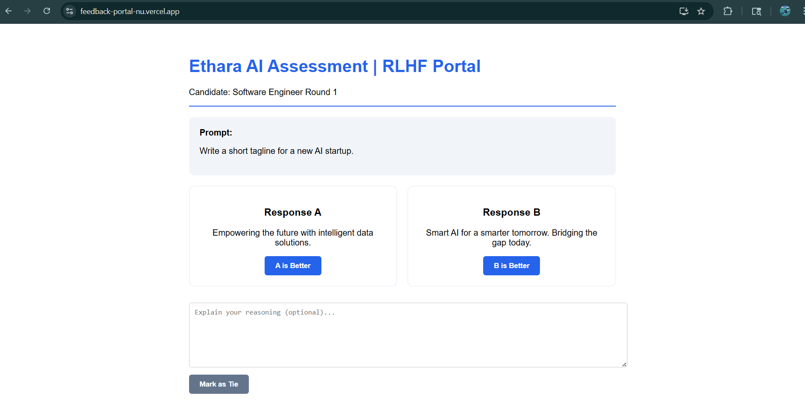
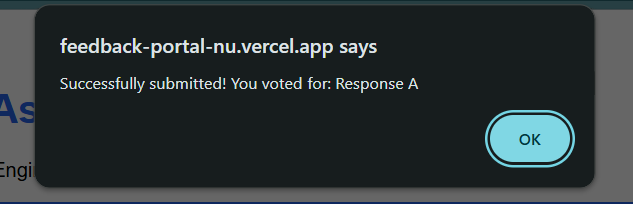
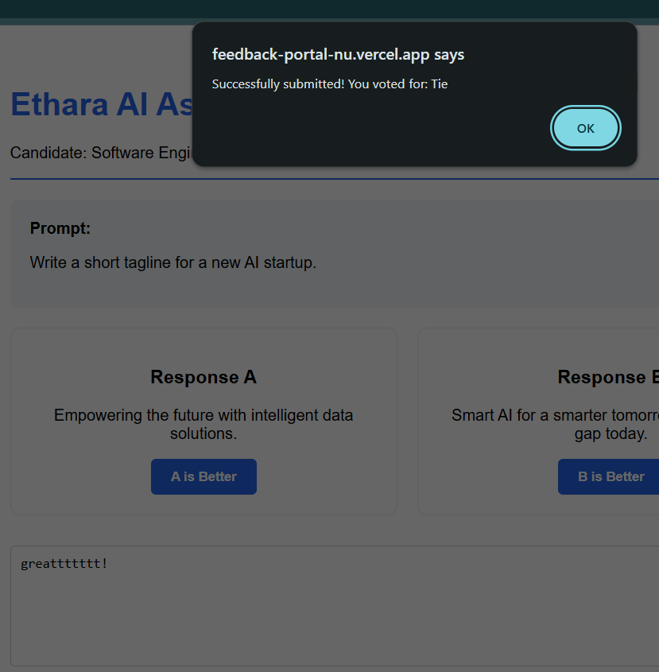
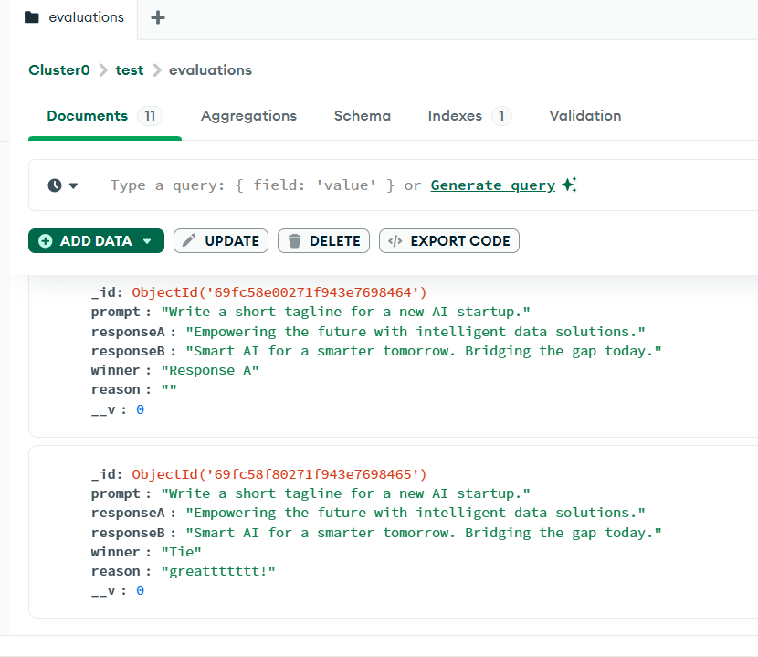

# 🚀 Feedback Portal

An AI-powered full-stack feedback and evaluation platform designed to streamline the process of collecting, analyzing, and managing user feedback efficiently.

## 🌐 Live Demo
https://feedback-portal-nu.vercel.app/

## 📌 Project Overview

The Feedback Portal enables users to submit feedback through an intuitive interface while providing administrators with a structured system to review and analyze responses. The project focuses on creating a scalable and user-friendly feedback management solution using modern web technologies.

## ✨ Features

- 📝 Submit feedback easily through interactive forms
- ⭐ Rating and evaluation system
- 📊 Organized feedback management
- 📱 Responsive user interface
- ⚡ Fast and optimized React frontend
- 🔒 Clean and maintainable code structure

## 🛠️ Tech Stack

### Frontend
- React.js
- JavaScript
- HTML5
- CSS3

### Tools & Deployment
- Git & GitHub
- Vercel Deployment

## 🎯 Future Enhancements

- Authentication system
- Dashboard analytics
- Database integration
- AI-based sentiment analysis
- Admin moderation panel

## 👩‍💻 Developed By

Sharanika A

- GitHub: https://github.com/sharanikaa

## 📸 Project Screenshots

### 🏠 Home Page

---

### 📝 Feedback Submission Form

---

### ⚙️ Backend Workflow

---

## 📄 License

This project is developed for educational and assessment purposes.
